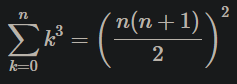

# Homework 0

## Zadání

- Stáhněte si k sobě program [soucet.py](files/soucet.py)
- Přejmenujte program na [cubic_sum.py](cubic_sum.py) a upravte jej tak, aby počítal součet třetích mocnin


- Dále upravte program tak, aby zkontroloval, zda se součet třetích mocnin rovná


- Program vytiskne na jednu řádku součet třetích mocnin, na další řádku vytiskne výsledek podle vzorečku
- Vytištěné výsledky musí být celá čísla.
- Program odevzdejte odevzdávacím systémem (úloha HW00).
- Příklady

Vstup:

```
4
```

Výstup:

```
100
100
```

```
Vstup:
12
Výstup:
6084
6084
```

```
Vstup:
5
Výstup:
225
225
```

