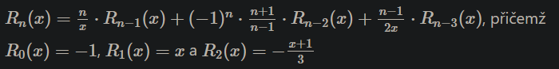

# Homework 7

## Zadání

### Lehká varianta
- Napište program recurrent.py pro výpočet následující rekurentní funkce:

- Program načte z první řádky standardního vstupu celé kladné číslo n a z druhé řádky standardního vstupu reálné číslo x.
- Program na výstup vytiskne hodnotu Rn(x).
- Ověření výsledku probíha s přesností na 8 desetinných míst.
- Program musí pracovat efektivně a umět spočítat hodnotu funkce R i pro hodnoty n=100
- Program v souboru recurrent.py odevzdejte do odevzdávacího systému (úloha HW07).

Například pro vstup:
```
5
1.5
```

program vytiskne:

```
-40.14814814814815
```

pro vstup

```
20
-15.3
```

program vytiskne:

```
948.4876144737897
```

a pro vstup

```
50
44.4
```

program vytiskne:

```
-800555.6302016332
```


### Těžká varianta

- Napište program [ubongo.py](ubongo.py), který si ze souboru se jménem prvního argumentu programu, přečte rozměr pole a díly, kterými má to pole zaplnit
  - první řádek obsahuje dvě čísla S R, kde R je počet řádků a S je počet sloupců obdélníkového pole
  - dále násluduje R řádků, kde
    - 0 - definují volná pole v matici, která se mají vyplnit zadanými dílky
    - -1 - definují obsazená pole, kam dílky nesmí zasahovat
    - čísla na jednom řádku jsou oddělena jednou nebo více mezerami (použijte funkci “split()” bez parametrů).
  - každý další řádek obsahuje popis jednoho dílku:
    - jedna řádka obsahuje souřadnice čtverečků (x y), ze kterých je sestaven celý dílek
    - souřadnice jsou uvedeny za sebou bez oddělovacích čárek a závorek
    - jednotlivé souřadnice mohou být libovolně posunuty, dílek nemusí obsahovat čtverec se souřadnicemi (0,0)
- Program v souboru [ubongo.py](ubongo.py) nalezne pokrytí volných polí matice dílky, které mohou být natočeny, ale nesmí být zrcadlově převráceny.
- Výstupem programu je pokrytí matice dílky, kdy plocha prvního dílku (zadaný v souboru hned za maticí volného místa) je vyplněna číslem 1, plocha druhého dílku (na další řádce za prvním dílkem) číslem 2, …
- Notace pro popis dílků: je to seznam x y souřadnic.
- Pro T-dílek na obrázku je jeho popis: 0 0 1 0 2 0 1 1

- Pro vstup
```
5 5
 0  0 0 0 0
 0  0 0 0 0
 0  0 0 0 0
-1  0 0 0 0
-1 -1 0 0 0
0 0 0 1 0 2 1 2 2 2 2 1
0 0 0 1 1 1 2 1 2 0 2 2
0 0 1 0 1 1 1 2 1 3
0 2 1 2 2 2 1 1 1 0
```
Graficky znázorněné všechny dílky této úlohy:
1. 
2. 
3. 
4. 

program vytiskne:

```
4 3 3 3 3
4 4 4 2 3
4 2 2 2 1
-1 2 1 2 1
-1 -1 1 1 1
```


