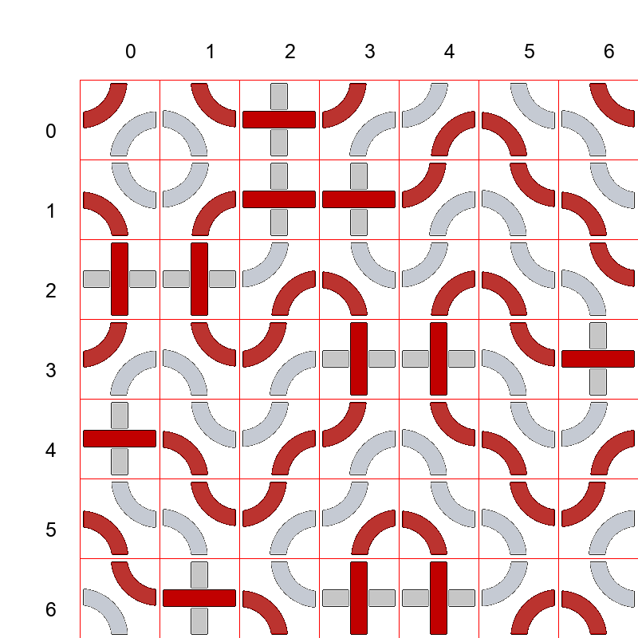

# Homework 8

## Zadání

### Lehká varianta
- Úkolem je nalézt v mapě světlé a tmavé cesty, které vedou zleva doprava a shora dolů.
- Program odevzdávejte do HW08 jako paths.py
- Příklad mapy:

- Vstup programu: jméno souboru jako první argument příkazové řádky.
  - Soubor obsahuje 2D matici zapsanou po řádcích, prvky v každém řádku jsou odděleny mezerou (počet řádků se nemusí rovnat počtu sloupců).
  - Prvky matice jsou řetězce o čtyřech znacích, které reprezentují jednotlivé dílky mapy.
  - Dílky jsou reprezentovány řetezcem složeným z písmen 'l' (light) a 'd' (dark) podle toho, kde se nachází světlé (tmavé) cesty. Dílek bez cest (prázdný) je označen 'none'.
  - Pořadí písmen je: west-north-east-south. Index písmene ve jménu dílku jsou:

- např. výše uvedený dílek má jméno “ldld”: light na pozici 0 (west), dark na pozici 1 (north), light na pozici 2 (east) a dark na pozici 3 (south).
- Bludiště je tvořeno těmito dílky:
  
|  |  |  |  |  |  |  |
|--------------------------|--------------------------|--------------------------|--------------------------|--------------------------|--------------------------|--------------------------|

- Příklad vstupního souboru:
```
lddl dldl dldl ddll
lldd dldl dldl dlld
ddll lldd dlld lddl
dldl ddll lddl dlld
```

- Tomuto souboru odpovidá


- Výstupem programu je čtveřice celých čísel oddělených mezerou na standardní výstup:
  - První číslo: počet dílků, které tvoří nejdelší světlou cestu, která vede zleva doprava
  - Druhé číslo: počet dílků, které tvoří nejdelší tmavou cestu, která vede zleva doprava
  - Třetí číslo: počet dílků, které tvoří nejdelší světlou cestu, která vede shora dolů
  - Čtvrté číslo: počet dílků, které tvoří nejdelší tmavou cestu, která vede shora dolů
  - Pokud taková cesta neexistuje, vypište '-1'.
  - Cesta je posloupnost dílků tak, že uvažovaná barva na sebe plynule navazuje.
  - Cesta pro danou barvu začíná (končí) v levé (pravé straně) pokud dílek touto barvou do uvedené strany směruje. Obdobně pro cesty shora dolů. Viz obrázek:


V tomto případě: existuje tmavá cesta zleva doprava (mezi body a-b), světlá cesta zleva doprava (a'-b'). Tmavá cesta mezi body c-d zleva doprava nevede, nebo v bodě c neprotíná levou stranu desky.

Pro načtení vstupního souboru můžete použít tuto funkci, která vrací 2D pole, každá buňka pak obsahuje jméno dílku (indexujeme [radek][sloupec]).

```
def loadBoard(filename):
    b = []
    f = open(filename,"r")
    for line in f:
        b.append( line.strip().split() )
    f.close()
    return b
```

- Brute bude testovat na různých mapách, nejmenší mapa 4×4, největší 25×25.
- Časový limit: 2s na 100 příkladů.

Příklady
- [Balíček s testovacími daty (lehká i tězká varianta)](files/hw08examples.zip)
- Příklad 1

Vstup:

```
ddll lddl dldl ddll lldd dlld lddl
dlld lldd dldl dldl ddll lddl dlld
ldld ldld lldd dlld lldd dlld lddl
ddll lddl ddll ldld ldld lddl dldl
dldl dlld lldd ddll lddl dlld lldd
dlld lddl ddll lldd dlld lddl ddll
lddl dldl dlld ldld ldld lldd dlld
```

Výstup:

```
-1 21 24 -1
```



Komentář: žádná světlá cesta nevedle zleva doprava (-1), tmavá cesta zleva doprava vede přes 21 dílků (z pozice 4,0 do pozice 2,6), délka světlé cesty shora dolů je 24 dílků, a žádná tmavá cesta nevede shora dolů (-1).

- Příklad 2

Vstup:

```
lddl none lldd
dlld lddl none
lddl dlld lldd
dlld lddl ddll
lddl dlld lldd
```

Výstup:

```
6 6 -1 -1
```


### Těžká varianta

- Uvažujme stejná vstupní data jako v lehké variantě.
- Úkolem je napsat program, který v mapě hledá světlé a tmavé cykly.
- Program odevzdávejte do Bruta jako cycles.py
- Vstup programu: jméno souboru jako první argument příkazové řádky
  - Interpretace vstupních dat je stejná jako v lehké variantě HW08.
- Výstup programu: čtveřice celých čísel oddělených mezerou s významem:
  - První číslo: počet světlých cyklů (nebo 0 pokud žádný takový neexistuje)
  - Druhé číslo: počet tmavých cyklů (nebo 0 pokud žádný takový neexistuje)
  - Třetí číslo: délka nejdelšího světlého cyklu (nebo 0 pokud žádný takový neexistuje)
  - Čtvrté číslo: délka nejdelšího tmavého cyklu (nebo 0 pokud žádný takový neexistuje)
- Cyklem se rozumí uzavřená cesta pro vybranou barvu, tato cesta musí celá ležet uvnitř mapy.
  - Délka cesty je počet buňek, které tuto cestu tvoří.
- Brute bude testovat na různých mapách, nejmenší mapa 4×4, největší 25×25.
- Časový limit: 2s na 100 příkladů.

Příklady
- [Balíček s testovacími daty (lehká i tězká varianta)](files/hw08examples.zip)
- Příklad 1

Vstup:

```
dlld lldd dlld ldld
ddll lddl ddll lddl
lldd dldl dlld lldd
lddl none ldld lddl
```

Výstup:

```
1 1 4 4
```


Komentář: mapa obsahuje jeden světlý cyklus a jeden tmavý cyklus, jejich délka je v obou případech 4 dílky.

- Příklad 2

Vstup:

```
ddll lddl ddll lddl
dlld lldd dlld lldd
ddll lddl ddll none
dlld none dldl ddll
```

Výstup:

```
2 1 4 4
```


Komentář: mapa obsahuje dva světlé cykly (délka nejdelšího je 4) a jeden tmavý cyklus délky 4.

- Příklad 3

Vstup:

```
lldd ddll ldld lddl ddll ldld ldld
lddl dldl ddll lldd dlld lddl ddll
dldl dldl dldl ddll lddl dldl dldl
dldl dlld lldd dlld lldd dlld lldd
lldd ddll lddl ddll lddl ddll ldld
lddl dlld lldd dlld lldd dlld ldld
lldd ddll ldld lddl ddll ldld ldld
```

Výstup:

```
4 2 10 4
```


Komentář: mapa obsahuje 4 světlé a 2 tmavé cykly. Délka nejdelšího světlého cyklu je 10, délka nejdelšího tmavého cyklu je 4.

- Příklad 4

Vstup:

```
ddll lldd dlld lddl
lldd ddll lddl dlld
lddl dlld lldd ddll
dlld lddl ddll lldd
```

Výstup:

```
1 1 4 12
```


- Příklad 5

Vstup:

```
lldd ddll lddl dldl dlld lldd dldl
ldld lldd dldl dldl ddll lddl dlld
lddl ddll lldd dlld lldd dlld ldld
dldl dlld ldld lddl ddll ldld lddl
dldl ddll lddl dldl dlld lddl dldl
dldl dlld lldd dlld lddl dlld lldd
dlld lddl ddll ldld lldd ddll lddl
```

Výstup:

```
2 0 8 0
```


Komentář: mapa obsahuje pouze 2 světlé cykly (délka nejdelšího je 8 políček). Mapa neobsahuje žádný tmavý cyklus.


