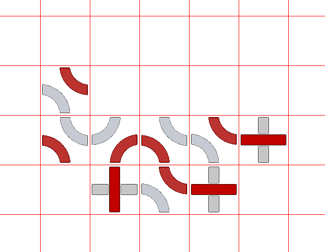
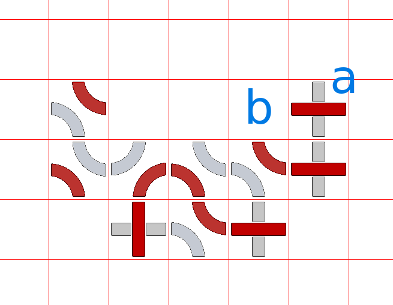
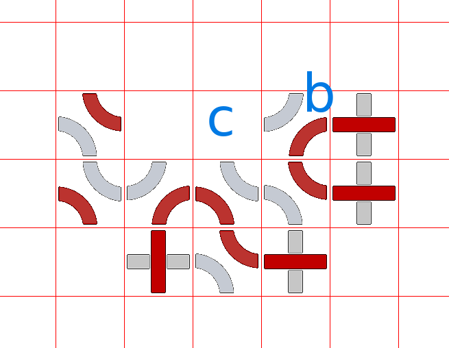
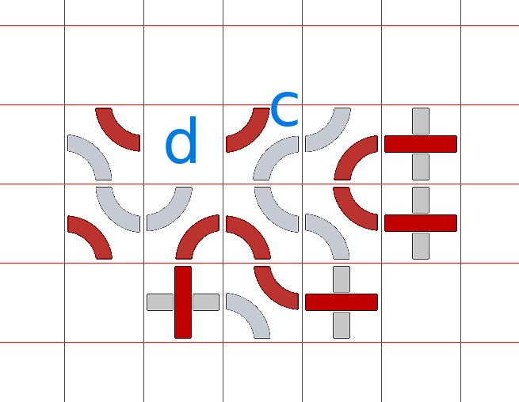
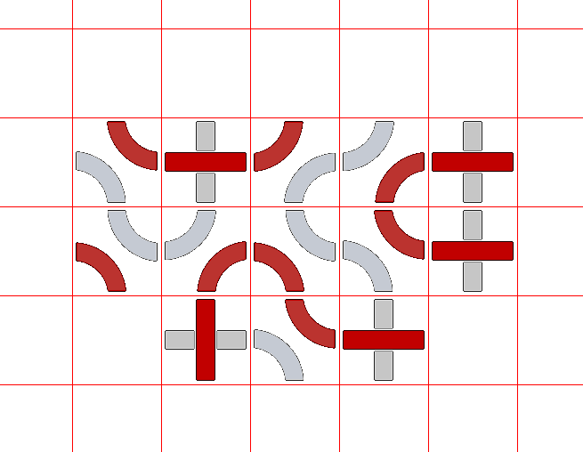

# Semestrální práce - TRAX!

Semestrální práce spočívá ve vytvoření funkčního hráče pro deskovku [TRAX](https://en.wikipedia.org/wiki/Trax_(game)) . Hráči pokládají na hrací desku dílky (znáte z [HW08](../homeworks/hw_08/hw_08.md)) s vyznačenými barevnými cestami tak, aby barevně navazovaly na již položené dílky. Hráči mají přiřazenu svoji barvu a pro tu se snaží vytvořit cyklus nebo spojit protilehlé strany. Naše hra pro předmět ALP se mírně liší od oficiálních pravidel TRAXu. Platná jsou pouze pravidla uvedená na této stránce.

## Historie a balíček
- Informace o turnaji a případných změnách v zadání semestrální práce budou v této sekci.
- Aktuální verze [balíčku s šablonou hráče](files/balicektrax.zip)
- 14.11.2022 Zveřejnění zadání
- 6.12.2022 Spuštění turnaje . Hry budou probíhat cca 1x denně. Finální turnaj, ze kterého budou přeneseny body ke zkoušce proběhne 13.1.2022, do té doby můžete opakovaně submitovat do Bruta svoje hráče a postupně je vylepšovat.
- 6.12.2022 Prosím nepoužívejte české znaky pro jména proměnných ani v komentářích, všechny programy jsou před spuštěním konvertovány do UTF-8 a pokud používáte jiné kódování (např. Latin-2), může konverze způsobit nefunkčnost vašeho hráče.

## Pravidla hry
- Hraje se na čtvercové hrací desce (rozměry minimálně 7×7, maximálně 25×25).
- Každý hráč má určenu svojí barvu (světlá nebo tmavá).
- Hra začíná z neprázdné hrací desky (např. doprostřed je umístěn náhodně vybraný dílek, nebo skupina správně postavených dílků).
- Každý hráč má k dispozici neomezený počet dílků všech typů (validní jména jsou: “lldd”,“dlld”,“ddll”,“lddl”,“dldl”,“ldld”)

- Postup hry:
  - Hráči se střídají.
  - Hráč na tahu umístí dílek (nebo skupinu dílků) dle následujících pravidel.
  - Pokud je již hrací deska plná, neumišťuje se žádný dílek a hra končí.
- Pravida pro pokládání dílků
  - Dílky se pokládají tak, že navazují alespoň jednou hranou na již položené dílky (tj. položené dílky tvoří jednu [Komponentu souvislosti](https://en.wikipedia.org/wiki/Component_(graph_theory))).
  - Položené dílky musí svými barevnými cestami navazovat na sousední dílky.
  - Vynucený tah: pokud při položení nového dílku vznikne prázné místo (nebo místa), do kterého vedou dvě cesty stejné barvy z okolních dílků, musí hráč na takové místo (nebo místa) položit další dílky tak, aby cesty propojil. Tento vynucený tah může dále vést na další vynucené tahy, které je třeba stejným způsobem vyřešit.
  - Platný tah hráče je takový, po němž nejsou na hrací desce žádná prázdná místa, do kterých vedou z okolních sousedů cesty dvou stejných barev.
  - Není možné umístit dílky, které by vedly na vznik prázdného místa, do kterého vedou z jeho sousedů více než dvě cesty stejné barvy.
- Ukončení hry:
  - V Brute:
    - dokud není zcela zaplněna hrací deska.
  - V Turnaji:
    - pokud hráč uzavře cyklus (nezáleží na tom, jakou má barvu) nebo dokončí cestu spojující dvě protilehlé strany hrací desky (tj. shora-dolu nebo zleva-doprava) (opět nezáleží na barvě), hra končí.
    - Využijte své řešení z [HW08](../homeworks/hw_08/hw_08.md)).
- Omezení:
  - jeden tah hráče může trvat nejvýše 1 s.
  - příprava hráče (tzv. konstruktor (bude vysvětleno na cvičeních)) může trvat také max. 1 s.

## Brute, Turnaj, bodování
- hráče odevzdávejte v souboru player.py do úlohy SEM.
- odevzdaný program bude hodnocen nejprve na Brutovi, potom v Turnaji.
- Hodnocení na Brutovi:
  - Brute otestuje vašeho hráče v nižších stovkách her (velikost hracích desek min. 7×7, max. 25×25).
  - Hry budou začínat z již předvyplněné hrací desky (bude zaručeno, že počáteční stav hrací desky bude v pořádku, tj. všechny dílky na sebe budou správně navazovat). Hrací deska bude tedy obsahovat minimálně jeden dílek, ale může být např. i skoro celá plná.
  - Není nutné Bruta porazit, ale je nutné hrát správně dle pravidel.
  - Hra bude pokračovat dokud nebude zaplněna celá hrací deska — tj. není nutné uzavírat cykly nebo se snažit spojovat protilehlé strany.
  - Pokud hráč neudělá ani jednu chybu, dostane 2 body, jinak dostane 0 bodů.
- Turnaj:
  - Všechny programy odevzdané na Brute budou automaticky převedeny do turnaje.
  - Turnaj bude spouštěn cca 1x denně (zahájení předpokládáme 1. týden v prosinci)
  - Hra v turnaji bude vždy začínat z hrací desky, ve které bude náhodně umístěn jeden dílek.
  - Hra v turnaji bude ukončena poté, co některý z hráčů uzavře cyklus nebo spojí protilehlé strany cestou (nezáleží na barvě).
  - Bodování jedné hry:
    - Hráč hrající za světlou barvu: délka cyklu světlé barvy (*) + délka světlé cesty spojující protilehlé strany (*).
    - Hráč hrající za tmavou barvu: délka cyklu tmavé barvy (*) + délka tmavé cesty spojující protilehlé strany (*).
    - (*) pokud existuje
    - Pozor: je možné, že světlý hráč uzavře tmavý cyklus (a naopak), což je korektní tah - v tom případě ale způsobí bodový zisk protihráče.
    - Pokud hráč jedním tahem uzavře cykly obou barev (nebo propojí dvě cesty mezi stranami hrací desky), bude se tomuto hráči připisovat dvojnásobný počet bodů.
  - V turnaji proběhnou hry všichni-proti-všem (každý pár cca 20 her, každý hráč bude ve stejném počtu her hrát za světlého i tmavého hráče)
  - Výsledné bodové ohodnocení hráče je součet bodů ze všech jeho her
  - Hráči, kteří během turnaje udělají alespoň jednu chybu, budou z turnaje vyřazeni
    - Pokud se to stane a hráč má již v Brute nenulový počet bodů, tyto body mu zůstavají
  - Pro bezchybné hráče sestavíme tabulku (sestupně dle součtu bodů)
  - Bodování v turnaji:
    - Prvních 10% bezchybných hráčů: 3 body
    - Dalších 20% bezchybných hráčů: 2 body
    - Dalších 20% bezchybných hráčů: 1 bod
  - Turnaj poběží opakovaně, poslední turnaj bývá typicky několik dní před první zkouškou z ALP (bude včas zvěřejněno). Do té doby je možné hráče ladit a posílat do Bruta vylepšené verze.

## Reprezentace díků

- Pro reprezentaci dílků a hrací desky používáme stejný způsob jako v HW08.
- Jména dílků jsou dána barvou (světlá/light - 'l', tmavá/dark - 'd') v pořadí west,north,east,south:


|  |  |  |  |  |  |
|---|---|---|---|---|---|
| ldld | dldl | ddll | lddl | lldd | dlld |

## Příklad vynuceného tahu
Výchozí stav hrací desky



Hráč se rozhodne umístit dílek na pozici 'a'. Do místa na pozici 'b' tak povedou dvě cesty stejné barvy. Hráč musí umístit nějaký dílek na pozici 'b', aby tyto cesty spojil.



Po umístění dílku na pozici 'c' vznikne na pozici 'd' stejná situace - do prázného místa vedou dvě cesty svejné barvy. Jedná se opět o vynucený tah, hráč tedy musí umístit další dílek na pozici 'd'.

 

Konečný stav:




## Implementace
- Stáhněte si balíček, ve kterém je šablona programu, kam budete implementovat svého hráče.
- Popis souborů:
  - base.py: základní třída, ze které jsou odvozeny další hráči. Neměňte.
  - player.py: zde budete implementovat svého hráče a tento soubor (pouze tento!) odevzdávejte na Bruta
  - draw.py: pomocná třída pro kreslení do png
- Hráče implementujte do třídy Player (soubor player.py), do metody move.
- Metoda move vrací:
  - [] pokud nejde umístit žádný dílek
  - [ [r1,c1,tile1], … [rn,cn,tile2] ], tj. seznam dílků a kam mají být umístěny, r_i jsou řádky (int), c_i jsou sloupce (int), tile_i jsou jména dílků (string délky 4).
- Proměnné, které jsou ve třídě Player k dispozici:
  - self.board - 2D pole hrací desky, indexování self.board[row][column]
    - self.board[row][col] je string délky 4, který obsahuje buď “none” (prázná buňka) nebo jméno dílku
    - používejte pro zápis i čtení
    - Brute bude automaticky aktualizovat self.board tak, aby obsahoval dílky umístěné vaším hráčem i spoluhráčem
  - self.playerName: jméno studenta - tuto proměnnou doplňuje Brute
  - self.myColor: je buď 'l' nebo 'd' a indikuje, za jakou barvu hrajete
  - self.tournament: je True pokud hrajete v turnaji, jinak je False
    - např. pro odevzdání na Bruta můžete použít hloupé strategie (rychlé), ale pro turnaj zapnete složitější strategii

```
if self.tournament:
   #slozita strategie, chci vyhravat
else:
    #hraju proti Brutovi, neni treba vyhrat
```

- self.tiles: pole jmen platných dílků
- self.algorithmName: jméno vaší strategie - slouží k identifikaci verze vašeho hráče v turnaji

## player.py
- svého hráče implementujte do player.py, zejména je třeba implementovat metodu move()
- otestování hry lokálně:

```
> cd adresar_kde_je_balicek
> python3 player.py
```

- součástí balíčku je jednoduchý modul draw.py, který kreslí hrací desku do PNG. K tomu si nainstalujte knihovnu PILLOW (https://pillow.readthedocs.io/en/stable/ )

```
import draw as Drawer
import sys
import random
import copy
import base as Base
 
class Player(Base.BasePlayer):
    def __init__(self, board, name, color):
        Base.BasePlayer.__init__(self,board, name, color)   #DO NOT CHANGE THIS LINE!!     
        self.algorithmName = "My great player"
 
    def move(self):
        """ return list of moves:
            []  ... if the player cannot move
            [ [r1,c1,piece1], [r2,c2,piece2] ... [rn,cn,piece2] ] -place tiles to positions (r1,c1) .. (rn,cn)
        """   
        return []
 
 
 
if __name__ == "__main__":
 
    boardRows = 10
    boardCols = boardRows
    board = [ [0]*boardCols for _ in range(boardRows) ]
 
    board[boardRows//2][boardCols//2] = ["lldd","dlld","ddll","lddl","dldl","ldld"][ random.randint(0,5) ]
 
    d = Drawer.Drawer()
 
    p1 = Player(board,"player1", 'l'); 
    p2 = Player(board,"player2", 'd');
 
    #test game. We assume that both player play correctly. In Brute/Tournament case, more things will be checked
    #like types of variables, validity of moves, etc...
 
    idx = 0
    while True:
 
        #call player for his move
        rmove = p1.move()
 
        #rmove is: [ [r1,c1,tile1], ... [rn,cn,tile] ]
        #write to board of both players
        for move in rmove:
            row,col, tile = move
            p1.board[row][col] = tile
            p2.board[row][col] = tile
 
        #make png with resulting board
        d.draw(p1.board, "move-{:04d}.png".format(idx))
        idx+=1
 
        if len(rmove) == 0:
            print("End of game")
            break
        p1,p2 = p2,p1  #switch players
```


